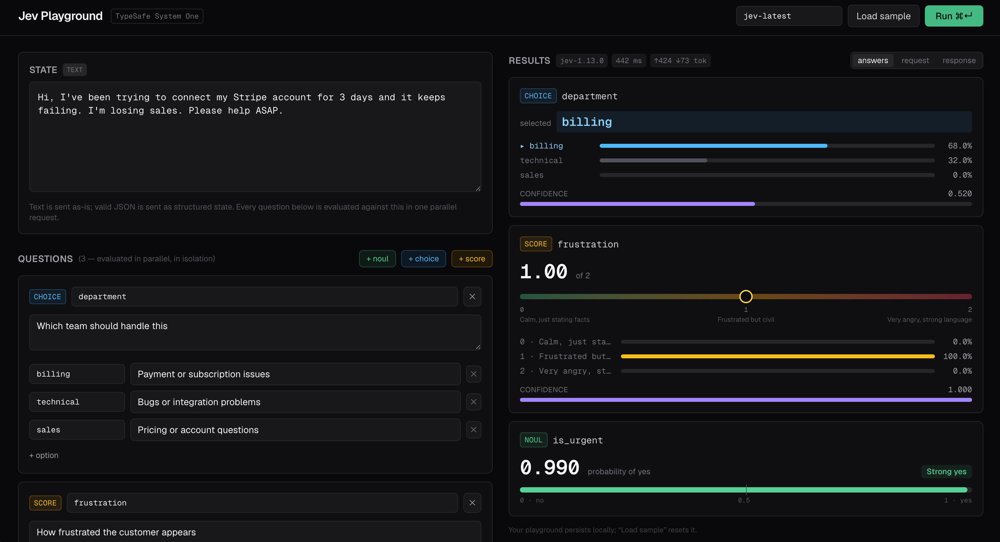

# Jev Playground

A small Next.js app for experimenting with [TypeSafe AI](https://typesafe.ai)'s
Jev model (System One). Paste a state, build any mix of **noul** (yes/no
probability), **choice** (pick from options), and **score** (rate against a
rubric) questions, and see the typed answers, probability distributions, and
confidence in one shot — all questions are evaluated in parallel in a single
request.



## Setup

1. Get an API key from the [TypeSafe console](https://console.typesafe.ai/settings/keys).
2. Put it in `.env.local`:

   ```
   TYPESAFE_API_KEY=ts-...
   ```

3. Run the dev server:

   ```sh
   npm install
   npm run dev
   ```

4. Open http://localhost:3000, hit **Load sample** for the docs' support-ticket
   example, then **Run** (or ⌘↵).

---

Plain text state is sent as a string; valid JSON is sent as structured state
(see the [State docs](https://docs.typesafe.ai/concepts/state)).
